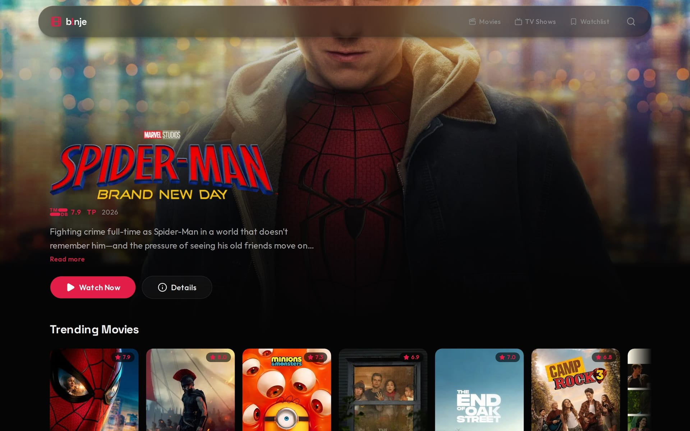
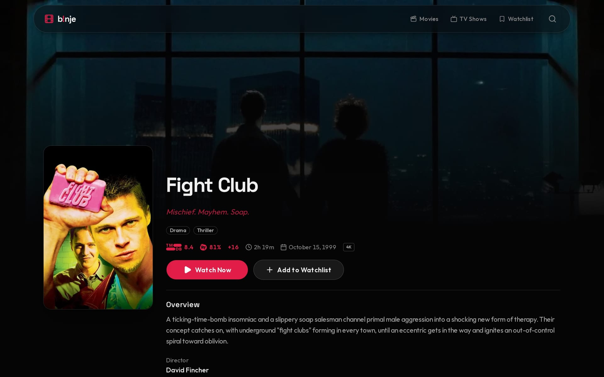
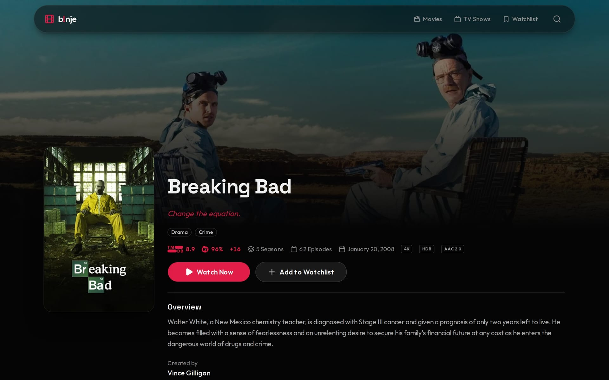
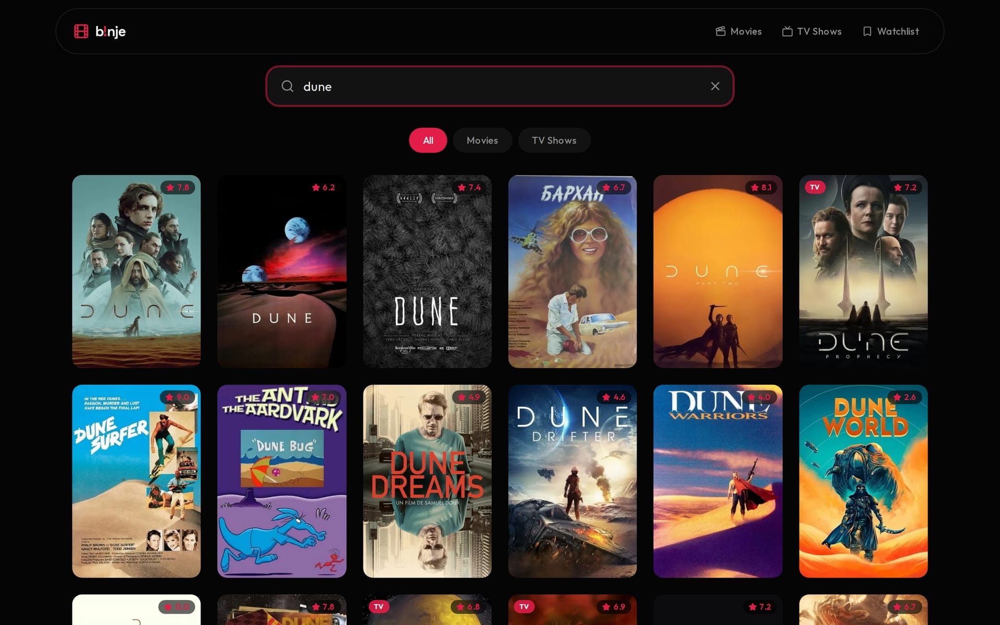
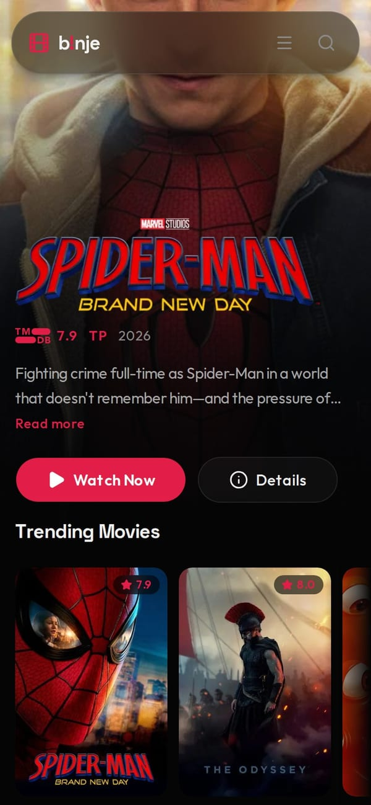
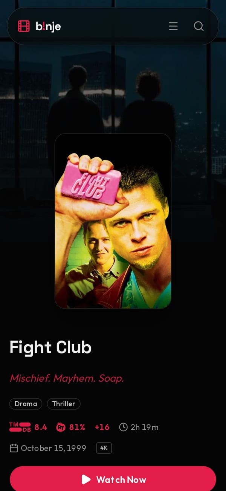
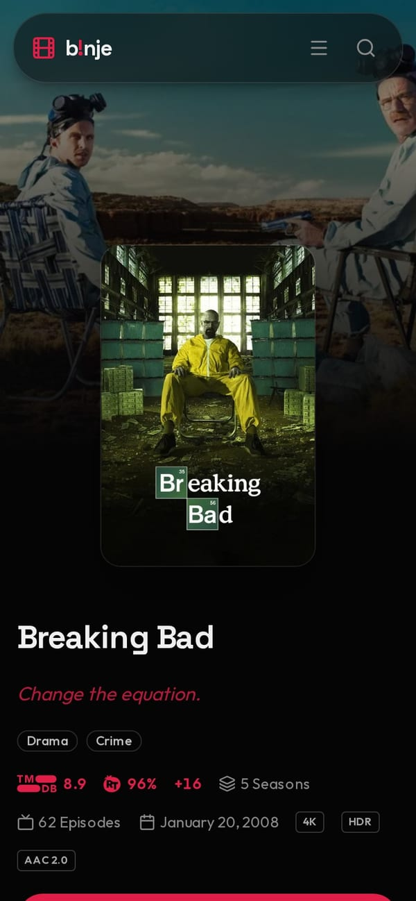
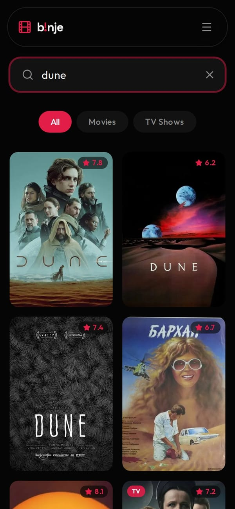

<p align="center">
  
</p>

<h1 align="center">b!nje</h1>

<p align="center">
   <strong>A movie and TV discovery app for web, Android, and iOS.</strong><br>
   <em>Powered by TMDB API with optional Rotten Tomatoes scores via OMDb.</em>
</p>

## Features

- Browse trending and popular movies & TV shows
- English and French interfaces at `/en` and `/fr`, with localized TMDB metadata
- Dedicated `/movies` and `/tv-shows` browse pages
- Detailed movie and TV show pages (ratings, cast, seasons, similar, recommendations)
- Search with fuzzy matching, year-aware ranking, and live navbar suggestions
- Watch pages with Videasy VO, optional VF, subtitles, and manual HLS quality selection
- TV episode scroller with edge fade and arrow controls, episode overlay preview cards
- "Continue Watching" row backed by local play history
- Hero with auto-rotating featured titles, two-line expandable overview, and TMDB/Rotten Tomatoes ratings
- Lazy-loaded carousels and loading skeletons
- Cookie consent banner that gates play-history writes, with a `/privacy` policy page
- Per-page SEO metadata via `generateMetadata`
- Image optimization (AVIF/WebP, TMDB-aligned responsive sizes, 30-day cache TTL)
- TMDB logos on watch pages
- Responsive dark theme (Tailwind v4, shadcn tokens, red accent)
- Expo SDK 57 mobile client with native navigation, local watchlist/history, and HLS playback

## Screenshots

### Desktop



Home: auto-rotating hero with TMDB rating and content certification, followed by trending carousels.



Movie detail: poster, TMDB and Rotten Tomatoes scores, runtime, stream tech badges, watchlist button.



TV detail: season and episode counts alongside the same ratings and playback badges.



Search: fuzzy, year-aware results with All / Movies / TV Shows filters.

### Mobile web

| Home | Movie | TV | Search |
| --- | --- | --- | --- |
|  |  |  |  |

Posters, backdrops, and logos in these screenshots come from TMDB.

## Tech stack

- Framework: Next.js 16 (Turbopack, App Router)
- UI: React 19, Tailwind CSS 4, shadcn tokens, Lucide icons
- Styling: clsx, tailwind-merge
- Data: TMDB (movies/TV), OMDb (optional Rotten Tomatoes scores)
- Player: hls.js with Videasy Yoru HQ/Neon fallback, server-side stream decryption, and `/api/hls`
- Language: TypeScript
- Testing: Bun test
- Mobile: Expo Router, React Native, expo-video, TanStack Query, AsyncStorage

## Getting started

### Prerequisites

- Bun
- A TMDB API key (set in `.env.local`)
- An optional OMDb API key (`OMDB_API_KEY`) for Rotten Tomatoes scores

Without `OMDB_API_KEY`, detail pages continue showing TMDB ratings only. OMDb content is
licensed for non-commercial use; commercial deployments should use a licensed ratings
provider.

### Installation

```bash
bun install
```

### Development

```bash
bun dev
```

Open [http://localhost:3000](http://localhost:3000) to view the app.
Unprefixed URLs redirect to `/en` or `/fr` from the browser language; use the
navbar language switch to change locale while keeping the current page.

Stream resolution uses the same-origin `/api/resolve` backend in development and production.

### Mobile development

```bash
cp apps/mobile/.env.example apps/mobile/.env
bun run mobile:start
```

The Expo application uses the Next.js deployment as its backend. See
[`apps/mobile/README.md`](./apps/mobile/README.md) for development-build and EAS instructions.

### Project structure

```
app/            # Next.js App Router pages and layouts
  [locale]/     # English/French pages
  api/          # Server routes (search, stream resolution, HLS, episodes)
  movie/[id]/   # Movie detail page
  movies/       # Browse all movies
  search/       # Search results
  tv/[id]/      # TV show detail page
  tv-shows/     # Browse all TV shows
  watch/[id]/   # Movie watch page
  watch/tv/[id] # TV episode watch page
  privacy/      # Privacy policy
components/     # Reusable web UI components (Hero, Carousel, Player, etc.)
apps/mobile/    # Expo Router application for Android and iOS
lib/            # Utilities and TMDB API client
types/          # TypeScript type definitions
public/         # Static assets
tests/          # Playwright tests
```

## Security notes

- `/api/hls` is not a general URL proxy. It only fetches hosts that `/api/resolve`,
  `/api/resolve-vf`, or a rewritten playlist handed out (6 hour in-memory TTL), so a
  segment request always has to follow a resolve on the same instance.
- The allowlist is per-instance and lost on restart; playback then needs a new resolve.
- Rate limiting keys on the right-most `X-Forwarded-For` entry, i.e. the one the reverse
  proxy in front of the app appends. Per-client limits therefore require that proxy to
  append the real client IP and to drop client-supplied forwarding headers.
- The CSP is enforced (not report-only); `unsafe-eval` is only added in development,
  where the Next dev runtime needs it.

## Privacy

b!nje uses your browser's `localStorage` to remember your watch history. No tracking, no
analytics, no third-party cookies. You can re-open the consent banner at any time from
the "Cookies" link in the footer. See [`/privacy`](./app/privacy/page.tsx) for details.

## License

MIT
